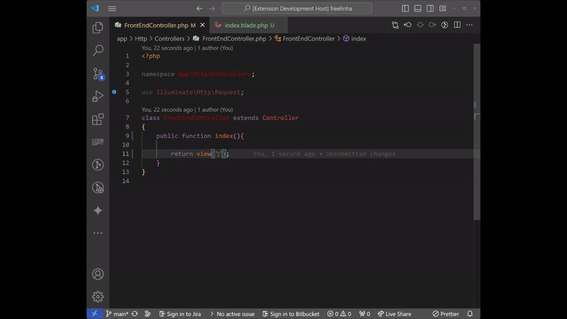

<h1>VS Code Laravel Blade Path to View String Extension</h1>

<h2>Description</h2>

This VS Code extension simplifies the process of copying the path of a Laravel Blade view and converting it into the string format required when returning a view in Laravel. It provides a convenient way to retrieve the path and convert it to the appropriate string format with just a few clicks.

<h3>Features</h3>

<ul>
  <li>Copy the path of a Laravel Blade view.</li>
  <li>Convert the copied path to the string format required for returning a view in Laravel.</li>
  <li>Easily accessible through the right-click context menu within the file or file tree.</li>
</ul>

<h2>Usage</h2>

<ol>
  <li>Right-click within the file or in the file tree where the Blade view is located.</li>
  <li>Select "Copy Blade Path" from the context menu.</li>
  <li>Paste the copied path directly into your Laravel code where you need to return a view.</li>
</ol>

<h2>Demo</h2>

<h2>Installation</h2>

To install the extension, follow these steps:

<ol>
  <li>Open VS Code.</li>
  <li>Go to the Extensions view by clicking on the square icon on the sidebar or pressing <code>Ctrl+Shift+X</code>.</li>
  <li>Search for "BladeCopyPath" in the Extensions Marketplace.</li>
  <li>Click "Install" to install the extension.</li>
</ol>

<h2>Feedback</h2>

Your feedback is valuable! If you encounter any issues or have suggestions for improvement, please feel free to <a href="https://github.com/thayronarrais/vscode-blade-copy-path/issues">file an issue</a> on GitHub.

<h2>Contributing</h2>

Contributions are welcome! If you would like to contribute to this extension, please fork the repository on <a href="https://github.com/thayronarrais/vscode-blade-copy-path">GitHub</a> and submit a pull request.

<h2>License</h2>

This extension is licensed under the <a href="LICENSE">MIT License</a>.

